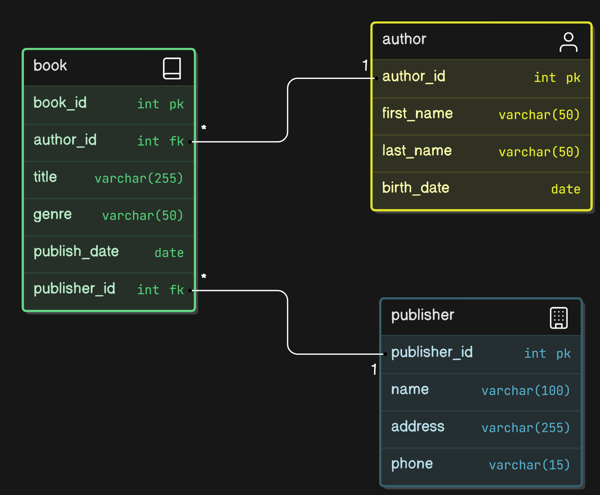

# Natural Language SQL Queries
My project models data about books, their authors, and their publishers. Contains basic information about each.



## Query I thought it did well on

**Question**: "Which books were published when their author was over 50 years old?"

**GPT SQL Response**:
```sql
SELECT b.book_id, b.title
FROM book b
JOIN author a ON b.author_id = a.author_id
WHERE EXTRACT(YEAR FROM age(b.publish_date, a.birth_date)) > 50;
```

**Friendly Response**: 
The books published when their author was over 50 years old are:
- The Lord of the Rings: The Fellowship of the Ring
- The Catcher in the Rye

## Question that it tripped up on
It struggled because it did not know the data being stored, only the tables and columns, so when asked to find fictional books, it searched for genres containing "fictional" in their name (as a guess), which was none of them, depsite "Fiction", "Science Fiction", or "Fantasy" being likely intended matches for the query.

Question: "What percent of books were fictional?"

**GPT SQL Response**:
```sql
SELECT (COUNT(CASE WHEN genre ILIKE 'fictional' THEN 1 END)::FLOAT / COUNT(*) * 100)
AS percent_fictional
FROM book;
```

**Friendly response**: 0% of books were fictional.

## Strategies
I mostly used zero-shot prompts, which was able to give surprisingly good results, but when it struggled due to lack of information on what data might look like (as strings, especially), using curated one-shot prompts helped it realize how data might be formatted and what to query for.

## Conclusion
As long as prompts are clear about what they are looking for, especially in relation to string data, the LLM is quite successful at generating quality queries and interpreting the results.
